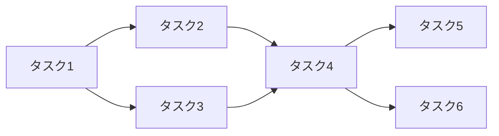

<!-- filepath: /C:/Users/cappu/Cafe/ProjectSummary.md -->

# コーヒー・ドリップ体験 インタラクティブコースター

## 目的
- 待ち時間を退屈にさせず、エンターテインメント体験を提供
- コーヒーの抽出過程を視覚、聴覚、ジェスチャー操作で楽しむ
- ミニゲームや操作要素でユーザーエクスペリエンスと参加感を向上

## 面白さ（Fun Factor）
- **リアルタイムドリップ可視化**  
  重力センサのデータに基づき、カップへの注ぎ方をアニメーション表示
- **ジェスチャー認識操作**  
  Webカメラと MediaPipe を活用し、指の本数で操作イベント（BGM、動画、ミニゲーム）を実現
- **ミニゲーム要素**  
  ドリップ量や速度をスコア化し、チャレンジや診断で報酬を提供
  コーヒー占いやおすすめのコーヒー診断
- **カスタムUI・BGM**  
  ユーザー好みのデザインとサウンドで待ち時間を楽しい体験に変換

## 全体構成
```mermaid
flowchart TD
    A[ハードウェア準備] --> B[センサデータ取得]
    A --> C[Webカメラ設置]
    B --> D[データ処理（重量変化解析）]
    C --> E[手掌認識(Mediapipe)]
    D --> F[ドリップアニメーション生成]
    E --> F
    F --> G[UI & 可視化]
    G --> H[ミニゲーム/操作イベント]
```

## タスク間の依存関係


## 実装タスク
| タスク番号 | タスク名                 | 内容                                                                                                          | 備考                            |
|----------|------------------------|---------------------------------------------------------------------------------------------------------------|---------------------------------|
| 1        | ハードウェア準備       | - 重力センサ（ロードセル + HX711）の用意<br>- Webカメラの設置                                                   | Raspberry PiとPC間の通信設定     |
| 2        | センサデータ取得 & 変換 | - 重量データをリアルタイム取得<br>- ドリップ量・速度の算出<br>- しきい値設定でイベントトリガ                        | センサキャリブレーション必須    |
| 3        | 手掌認識の実装         | - MediaPipe Hands を使用した手のひら検出<br>- 指の本数で操作イベント（1本：BGM, 2本：動画, 3本：ミニゲーム）        | 認識精度調整が必要              |
| 4        | UI & 可視化の構築      | - WebアプリまたはUnityでアニメーションUI作成<br>- 重量変化に応じたアニメーションとインジケータ表示                  | リアルタイム反映必須             |
| 5        | ミニゲームの実装       | - 「適量を注ごう」：一定時間ごとの計測値でスコア化<br>- 「ピッタリチャレンジ」：目標量との差を評価<br>- 「豆の種類診断」：抽出特性から判定 | ゲームルールと難易度調整必要      |
| 6        | 全体統合 & 調整        | - センサ、カメラ、UI間のデータ通信最適化<br>- 遅延対策（特にカメラ処理とUI更新）<br>- フィードバック機能の精度調整      | 統合テストを実施                |

## 改善案
- **エンターテインメント性の強化**
  - キャラクターの成長システム
  - 複数人でのインタラクティブ対戦モード
  - ユーザーエクスペリエンスのさらなる向上
- **ビジュアル・サウンド効果**
  - LED等でのビジュアルフィードバック追加
  - サウンドエフェクトの強化
  - ジェスチャー操作の直感的改善
- **技術発展性**
  - 複数コースター間の通信連動
  - データ可視化・分析機能の追加
  - カスタマイズ可能なUIの実装

このドキュメントは、プロジェクトの全体像と実装タスクを明確にし、開発のガイドラインとして活用してください。

